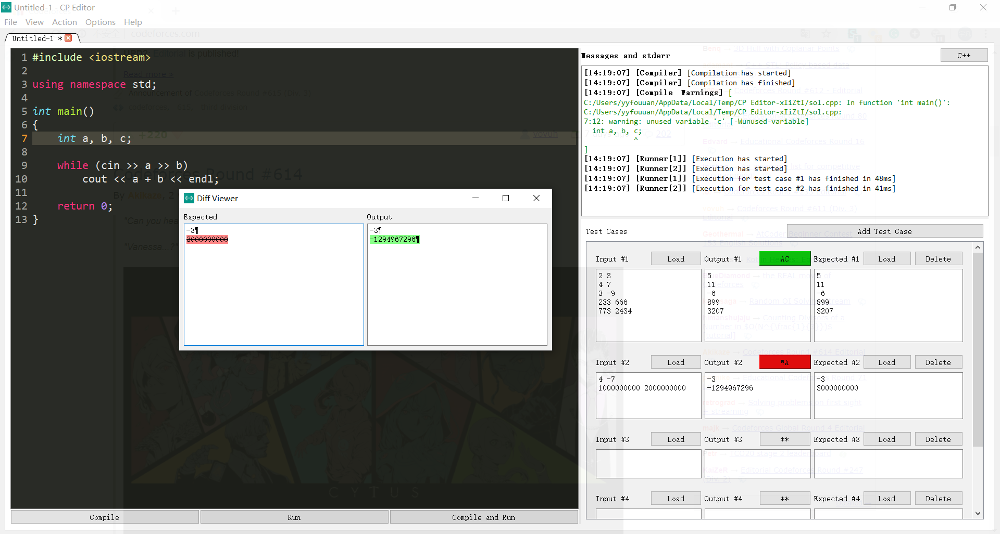

# CP Editor


[](https://www.codacy.com/gh/cpeditor/cp-editor)
[](https://t.me/cpeditor)
[](https://github.com/cpeditor/cp-editor/issues?q=is%3Aissue+is%3Aopen+label%3A%22help+wanted%22)

| type  |                           branch                            |                                                                                            build                                                                                             |                                                                    downloads                                                                     |
| :---: | :---------------------------------------------------------: | :------------------------------------------------------------------------------------------------------------------------------------------------------------------------------------------: | :----------------------------------------------------------------------------------------------------------------------------------------------: |
| alpha | [master](https://github.com/cpeditor/cp-editor/tree/master) | [](https://github.com/cpeditor/cp-editor/actions?query=branch%3Amaster) |                                                                        -                                                                         |
| beta  |   [v6.0](https://github.com/cpeditor/cp-editor/tree/v6.0)   |   [](https://github.com/cpeditor/cp-editor/actions?query=branch%3Av6.0)   | [](https://github.com/cpeditor/cp-editor/releases/tag/6.0.3) |

**CP Editor** is a native Qt-based code editor. It's specially designed for competitive programming, unlike other editors/IDEs which are mainly for developers. It helps you focus on your algorithm and automates the compilation, executing and testing. It even fetches test cases for you from different platforms and submits solutions to Codeforces!

### Features

- Parse sample test cases from over 30+ online platforms (including Codeforces, AtCoder, CodeChef, Yandex...), load test cases from files, or type manually.
- One click for either running on the test cases / running in the terminal.
- Use built-in or custom testlib checkers to get the verdicts.
- Diff Viewer for the running result.
- Submit codes to Codeforces inside the editor.
- Set/Use code snippets conveniently.
- Supports Hot Exit. You can close the editor and keep all tabs in the next session.
- Use Clang Format to format codes with your own configuration file.
- You can set the transparency of the editor.
- Over 5 editor themes to choose from (Drakula, Monkai, Solarised, Solarised Dark and Light).



### Installation

Head over to the [release page](https://github.com/cpeditor/cp-editor/releases) and download the binary/installer depending upon your OS.
- Windows users can find a `setup.exe` for installation.
- Linux users can find an `AppImage`:
  1. `chmod +x <AppImagePath>` or make it executable in GUI by right-clicking on it.
  2. Just run it, either from bash or in GUI.
- Get the .dmg file from releases and install as you install other apps
  > *Note: You may need to click "Yes" to access Filesystem several times. Apple may report that this application does not comes from recognised developer and prevent you from launching app. Please add an exception to the Editor from `Settings-> Security -> General`, and allow CPEditor to `run anyways`*

For Chinese users who are not convenient to download on Github, there is an [alternative download link](https://pan.wzf2000.top/s/md70l8h0) (it's not guaranteed to be up to date).

### Initial setup

- Install `g++` / `python` / `java` depending on which language you are using. Make sure that they are in the system PATH so that you can run them directly in the command line.

- Set preferences in the preference window.

- If you want to use the Competitive Companion for parsing examples from online platforms like Codeforces, install it [here](https://github.com/jmerle/competitive-companion). Don't forget to set the same port for the editor and the browser extension.

- If you want to use CF-Tool for submitting on Codeforces inside the editor, install it [here](https://github.com/xalanq/cf-tool). Don't forget to configure it by `cf config` (set the user and the template).

### For Java users

You **must not** make your Java class public, and the name of the class should be `a` .

### Keyboard Shortcuts

You can get the shortcuts in the menu.

The key bindings for the code editor are [here](https://doc.qt.io/qt-5.14/qtextedit.html#read-only-key-bindings) and [here](https://doc.qt.io/qt-5.14/qtextedit.html#editing-key-bindings).

You can also set hotkeys for some actions manually in `Preferences`. However the standard keys are fixed and cannot be changed, hotkeys are additional shortcuts.

### Build from source

1. Clone this repo:

	```sh
	git clone https://github.com/cpeditor/cp-editor.git
	cd cp-editor
	git submodule init
	git submodule update
	```

2. Install [Qt](https://www.qt.io/download) (5.12 or higher) and [CMake](https://cmake.org/download/) (3.12 or higher).
   - If you are using Linux/Mac, you can install from your package manager. For example, `sudo pacman -S qt5` on Arch Linux, `brew install qt5` on Mac OS.
   - You can also download the [offline installer](https://www.qt.io/offline-installers), or download from the [mirrors](https://download.qt.io/static/mirrorlist/). The path from the root of the mirror should be like `/qt/official_releases/qt/5.14/5.14.0/qt-opensource-<platform>-5.14.0.<suffix>` (or other versions).

3. Set environment variable `CMAKE_PREFIX_PATH=%QtPath%/%QtVersion%/%Compiler%/lib/cmake` if necessary (i.e. cmake can't find the Qt installation path.).
   - On Mac, run something like `export CMAKE_PREFIX_PATH="/usr/local/Cellar/qt/5.14.0"`.

4. Run the following commands:
	
	- Linux:

		```sh
		mkdir build
		cd build
		cmake .. -DCMAKE_BUILD_TYPE=Release
		cmake --build .
		```

	- Windows:

		```bat
		mkdir build
		cd build
		cmake ..
		cmake --build . --config Release
		```

### Use Artifacts

If you want to use the latest version (even later than the beta release), but don't want to build from source, you can download Artifacts from [Github Actions](https://github.com/cpeditor/cp-editor/actions).

However, it's not recommended to use Artifacts, they are more unstable than beta releases, and may be a work in progress. You should read the commit logs and even the source codes before using Artifacts.

In order to run it on Windows/MacOS, you should install from [Releases](https://github.com/cpeditor/cp-editor/releases) first (usually any version is OK, unless something like DLL missing happens). On Windows, replace `CPEditor.exe` in your install folder with the Artifact. On Mac, run `cp <Artifact> CPEditor.app/Contents/MacOs`, where `CPEditor.app` is the one already installed on your machine.

In order to run it on Ubuntu 18.04, you need to install Qt. Other Linux distributions may not support binaries compiled on Ubuntu 18.04.

### Contribution

If you found any bugs or have any feature requests, please open an issue [here](https://github.com/cpeditor/cp-editor/issues), and don't forget to follow the issue templates. Users' responses are important for contributors to improve the project.

If you want a try on developing, you can install Qt and CMake, then fix bugs / make new features by yourself! After finishing the coding, just open a pull request [here](https://github.com/cpeditor/cp-editor/pulls). Don't worry if you are not familiar with Qt / GUI programming, Google is your friend, and Qt is a [well documented](https://doc.qt.io/) library. Don't forget to use `.clang-format` file in the root directory to format the codes.

Contributions are always welcomed. Together we can build a better editor for ourselves.

For more information, please read [CONTRIBUTING.md](CONTRIBUTING.md).

### Telegram group

You can join the [Telegram group](https://t.me/cpeditor) for asking quetions about using the editor / developing.

### FAQ

- I am using it in Java and the editor is not working.
   - Make sure `java` and `javac` are in PATH variables. Please Log/Restart your machine if it does not recognize the Java Compiler. Now make sure your source code has **non-public class named a**.
- I get **DLL Missing error** while launching the application?
   - Please download  [Microsoft Visual C++ Redistributable for Visual Studio 2015, 2017 and 2019](https://support.microsoft.com/en-us/help/2977003/the-latest-supported-visual-c-downloads).
- What is Competitive Companion and how do I set it up to parse test cases from websites?
   - Please read this [blog](https://codeforces.com/blog/entry/72067) carefully. It has detailed instructions on setting up the competitive companion to parse test cases.
- What is CF-Tool and where to download it?
   - CF tools provide you to perform many actions like submitting code on Codeforces from the command line. It is a CLI application that can be downloaded from [here](https://github.com/xalanq/cf-tool/releases). It is a standalone executable, simply keep it in a directory and add that directory to PATH.
- I am using it on Codeforces but the submit button is not clickable.
   - Please reboot if you have already added `cf` to your PATH. If you haven't already, add `cf` to your PATH. Submit button will be active only if the editor finds that the `cf` tool is on PATH and invokable.
 - When I click on Submit on Codeforces, I get some message saying template is required?
    - `cf` tool requires that you first configure it before you use it. Please read this [blog](https://codeforces.com/blog/entry/72952) carefully to configure it for your device.

License
----

[GNU General Public License Version 3.0](https://github.com/cpeditor/cp-editor/blob/master/LICENSE)
