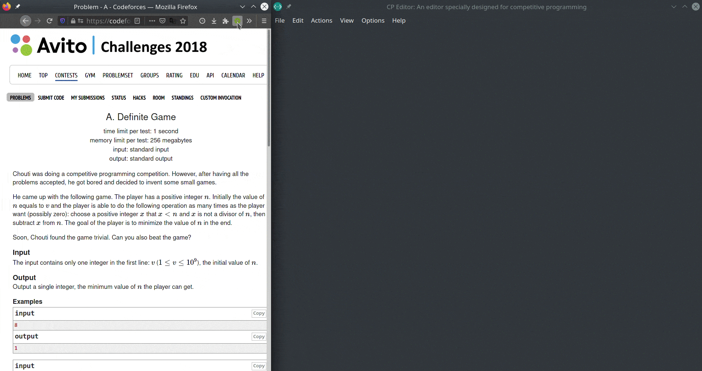

**CP Editor - 提升你的算法竞赛编程体验！**

**[特性](https://cpeditor.org/zh) · [文档](https://cpeditor.org/zh/docs) · [更新日志](CHANGELOG.md) · [贡献指南](CONTRIBUTING_zh-CN.md) · [FAQ](https://cpeditor.org/zh/docs/faq/)**

[English](README.md) · [Русский](README_ru-RU.md)

|  类型  |                            分支                            |                                                                                                        构建                                                                                                        |                                                                     下载量                                                                     |                                                         AUR                                                         |
| :----: | :--------------------------------------------------------: | :----------------------------------------------------------------------------------------------------------------------------------------------------------------------------------------------------------------: | :--------------------------------------------------------------------------------------------------------------------------------------------: | :-----------------------------------------------------------------------------------------------------------------: |
| alpha  | [master](https://github.com/cpeditor/cpeditor/tree/master) |  |                                                                       -                                                                        |  |
|  beta  |   [v6.8](https://github.com/cpeditor/cpeditor/tree/v6.8)   |      |  |                                                          -                                                          |
| stable |   [v6.7](https://github.com/cpeditor/cpeditor/tree/v6.7)   |      |  |          |

## 开始使用

-   [发行版](https://github.com/cpeditor/cpeditor/releases) ([Gitee 镜像](https://gitee.com/ouuan/cpeditor/releases))
-   [安装](https://cpeditor.org/zh/docs/installation/)
-   [开始使用](https://cpeditor.org/zh/docs/setup/)
-   [设置](https://cpeditor.org/zh/docs/preferences)
-   [使用提示](https://cpeditor.org/zh/docs/tips/)

## 捐赠

-   [如何捐赠](DONATE_zh-CN.md)
-   [捐赠者列表](DONATORS.md)

## 做出贡献

-   [贡献指南](CONTRIBUTING_zh-CN.md)
-   [适合新手解决的 issues](https://github.com/cpeditor/cpeditor/issues?q=is%3Aissue+is%3Aopen+label%3A%22good+first+issue%22)
-   [需要帮助的 issues](https://github.com/cpeditor/cpeditor/issues?q=is%3Aissue+is%3Aopen+label%3A%22help+wanted%22)

## 反馈

-   提问：开一个 Q&A 类别的 [新讨论](https://github.com/cpeditor/cpeditor/discussions/new)。请在得到答复后将最有用的回答 Mark as Answer。
-   提供想法：开一个 Ideas 类别的 [新讨论](https://github.com/cpeditor/cpeditor/discussions/new)。
-   正式的功能请求/bug 报告：[开一个 issue](https://github.com/cpeditor/cpeditor/issues/new/choose)，带有详细的描述以及尽可能多的信息。
-   [表达感谢](https://github.com/cpeditor/cpeditor/discussions/755)
-   [随意吐槽](https://github.com/cpeditor/cpeditor/discussions/760)

## 打包情况

如果需要帮助，软件包维护者可以联系我们。例如，我们可以在我们的 CI/CD 工作流中加入一些脚本。

Package maintainers can contact us if any help on packaging is needed. For example, we may add scripts in our CI workflow.

## 关于 Gitee

本项目同时在 [GitHub](https://github.com/cpeditor/cpeditor) 和 [Gitee](https://gitee.com/ouuan/cpeditor) 上进行托管，其中 Gitee 仓库仅作为镜像使用，不保证总是与 GitHub 仓库同步，不开放 Issues / Pull Requests，如有需要请移步 [GitHub](https://github.com/cpeditor/cpeditor)，也可以进入 [QQ 群](https://jq.qq.com/?_wv=1027&k=50eq8yF) (1081647997) 来交流讨论。

## All Contributors

感谢下面这些人的贡献：（[emoji key](https://allcontributors.org/docs/en/emoji-key)）

<!-- ALL-CONTRIBUTORS-LIST:START - Do not remove or modify this section -->
<!-- prettier-ignore-start -->
<!-- markdownlint-disable -->
<table>
  <tr>
    <td align="center">
       <a href="https://github.com/ouuan"><b>Yufan You</b></a> <a href="#maintenance-ouuan" title="Maintenance">🚧</a> <a href="https://github.com/cpeditor/cpeditor/commits?author=ouuan" title="Code">💻</a> <a href="https://github.com/cpeditor/cpeditor/commits?author=ouuan" title="Documentation">📖</a> <a href="#translation-ouuan" title="Translation">🌍</a> <a href="#ideas-ouuan" title="Ideas, Planning, & Feedback">🤔</a> <a href="https://github.com/cpeditor/cpeditor/issues?q=author%3Aouuan" title="Bug reports">🐛</a> <a href="https://github.com/cpeditor/cpeditor/pulls?q=is%3Apr+reviewed-by%3Aouuan" title="Reviewed Pull Requests">👀</a> <a href="#infra-ouuan" title="Infrastructure (Hosting, Build-Tools, etc)">🚇</a>
    </td>
    <td align="center">
       <a href="https://github.com/coder3101"><b>Ashar</b></a> <a href="#maintenance-coder3101" title="Maintenance">🚧</a> <a href="https://github.com/cpeditor/cpeditor/commits?author=coder3101" title="Code">💻</a> <a href="https://github.com/cpeditor/cpeditor/commits?author=coder3101" title="Documentation">📖</a> <a href="#ideas-coder3101" title="Ideas, Planning, & Feedback">🤔</a> <a href="https://github.com/cpeditor/cpeditor/issues?q=author%3Acoder3101" title="Bug reports">🐛</a> <a href="https://github.com/cpeditor/cpeditor/pulls?q=is%3Apr+reviewed-by%3Acoder3101" title="Reviewed Pull Requests">👀</a> <a href="#infra-coder3101" title="Infrastructure (Hosting, Build-Tools, etc)">🚇</a>
    </td>
    <td align="center">
       <a href="https://github.com/neko-para"><b>liaohy</b></a> <a href="https://github.com/cpeditor/cpeditor/commits?author=neko-para" title="Code">💻</a> <a href="https://github.com/cpeditor/cpeditor/commits?author=neko-para" title="Documentation">📖</a> <a href="#translation-neko-para" title="Translation">🌍</a> <a href="#ideas-neko-para" title="Ideas, Planning, & Feedback">🤔</a> <a href="https://github.com/cpeditor/cpeditor/pulls?q=is%3Apr+reviewed-by%3Aneko-para" title="Reviewed Pull Requests">👀</a>
    </td>
    <td align="center">
       <a href="http://sadykhzadeh.github.io"><b>Azer Sadykhzadeh</b></a> <a href="#translation-sadykhzadeh" title="Translation">🌍</a>
    </td>
    <td align="center">
       <a href="http://izobretatelsoft.moy.su/"><b>IZOBRETATEL777</b></a> <a href="#translation-IZOBRETATEL777" title="Translation">🌍</a> <a href="https://github.com/cpeditor/cpeditor/pulls?q=is%3Apr+reviewed-by%3AIZOBRETATEL777" title="Reviewed Pull Requests">👀</a> <a href="#infra-IZOBRETATEL777" title="Infrastructure (Hosting, Build-Tools, etc)">🚇</a>
    </td>
    <td align="center">
       <a href="https://www.linkedin.com/in/razdeeproychowdhury"><b>Rajdeep Roy Chowdhury</b></a> <a href="https://github.com/cpeditor/cpeditor/commits?author=Razdeep" title="Code">💻</a> <a href="#ideas-Razdeep" title="Ideas, Planning, & Feedback">🤔</a> <a href="https://github.com/cpeditor/cpeditor/issues?q=author%3ARazdeep" title="Bug reports">🐛</a>
    </td>
  </tr>
  <tr>
    <td align="center">
       <a href="https://github.com/testitem"><b>queen bee shuttle</b></a> <a href="https://github.com/cpeditor/cpeditor/commits?author=testitem" title="Documentation">📖</a> <a href="#ideas-testitem" title="Ideas, Planning, & Feedback">🤔</a> <a href="https://github.com/cpeditor/cpeditor/issues?q=author%3Atestitem" title="Bug reports">🐛</a>
    </td>
    <td align="center">
       <a href="https://yatharth1706.github.io/"><b>Yatharth Verma</b></a> <a href="https://github.com/cpeditor/cpeditor/commits?author=yatharth1706" title="Code">💻</a> <a href="https://github.com/cpeditor/cpeditor/issues?q=author%3Ayatharth1706" title="Bug reports">🐛</a>
    </td>
    <td align="center">
       <a href="https://github.com/polyomino-24"><b>polyomino</b></a> <a href="https://github.com/cpeditor/cpeditor/commits?author=polyomino-24" title="Documentation">📖</a>
    </td>
    <td align="center">
       <a href="https://studyingfather.com"><b>Shuhao Zhang</b></a> <a href="#ideas-StudyingFather" title="Ideas, Planning, & Feedback">🤔</a> <a href="https://github.com/cpeditor/cpeditor/pulls?q=is%3Apr+reviewed-by%3AStudyingFather" title="Reviewed Pull Requests">👀</a> <a href="#translation-StudyingFather" title="Translation">🌍</a>
    </td>
    <td align="center">
       <a href="https://github.com/palob"><b>Vincent Bermel</b></a> <a href="#infra-palob" title="Infrastructure (Hosting, Build-Tools, etc)">🚇</a>
    </td>
    <td align="center">
       <a href="https://github.com/tb148"><b>Tony Brown</b></a> <a href="#ideas-tb148" title="Ideas, Planning, & Feedback">🤔</a> <a href="https://github.com/cpeditor/cpeditor/commits?author=tb148" title="Code">💻</a> <a href="https://github.com/cpeditor/cpeditor/commits?author=tb148" title="Documentation">📖</a>
    </td>
  </tr>
  <tr>
    <td align="center">
       <a href="https://github.com/sonulohani"><b>Sonu Lohani</b></a> <a href="https://github.com/cpeditor/cpeditor/issues?q=author%3Asonulohani" title="Bug reports">🐛</a> <a href="https://github.com/cpeditor/cpeditor/commits?author=sonulohani" title="Code">💻</a> <a href="#ideas-sonulohani" title="Ideas, Planning, & Feedback">🤔</a>
    </td>
    <td align="center">
       <a href="https://chungzh.cc/"><b>Flex Zhong</b></a> <a href="https://github.com/cpeditor/cpeditor/commits?author=ChungZH" title="Code">💻</a>
    </td>
    <td align="center">
       <a href="http://ravenclaw-oier.github.io"><b>Ravenclaw-OIer</b></a> <a href="#ideas-Ravenclaw-OIer" title="Ideas, Planning, & Feedback">🤔</a> <a href="https://github.com/cpeditor/cpeditor/issues?q=author%3ARavenclaw-OIer" title="Bug reports">🐛</a> <a href="https://github.com/cpeditor/cpeditor/commits?author=Ravenclaw-OIer" title="Documentation">📖</a>
    </td>
    <td align="center">
       <a href="https://github.com/tuwuna"><b>tuwuna</b></a> <a href="#ideas-tuwuna" title="Ideas, Planning, & Feedback">🤔</a>
    </td>
    <td align="center">
       <a href="https://github.com/nikhil-sarda"><b>Nikhil Sarda</b></a> <a href="https://github.com/cpeditor/cpeditor/issues?q=author%3Anikhil-sarda" title="Bug reports">🐛</a>
    </td>
    <td align="center">
       <a href="https://github.com/Arthur-QQ"><b>Arthur-QQ</b></a> <a href="#ideas-Arthur-QQ" title="Ideas, Planning, & Feedback">🤔</a> <a href="https://github.com/cpeditor/cpeditor/issues?q=author%3AArthur-QQ" title="Bug reports">🐛</a>
    </td>
  </tr>
  <tr>
    <td align="center">
       <a href="https://github.com/Brijesh1in"><b>Brijesh1in</b></a> <a href="#ideas-Brijesh1in" title="Ideas, Planning, & Feedback">🤔</a> <a href="https://github.com/cpeditor/cpeditor/issues?q=author%3ABrijesh1in" title="Bug reports">🐛</a>
    </td>
    <td align="center">
       <a href="https://github.com/DarkWarrior703"><b>DarkWarrior703</b></a> <a href="#ideas-DarkWarrior703" title="Ideas, Planning, & Feedback">🤔</a>
    </td>
    <td align="center">
       <a href="http://pavankumar31072000@gmail.com"><b>v-O_O-v</b></a> <a href="https://github.com/cpeditor/cpeditor/issues?q=author%3A1CH1GO" title="Bug reports">🐛</a>
    </td>
    <td align="center">
       <a href="http://www.apoorvarajbhadani.blogspot.com"><b>Apoorva Raj Bhadani</b></a> <a href="https://github.com/cpeditor/cpeditor/issues?q=author%3AApoorvaRajBhadani" title="Bug reports">🐛</a>
    </td>
    <td align="center">
       <a href="https://github.com/Exile-2k4"><b>Nguyễn Hoàng Dương</b></a> <a href="#ideas-Exile-2k4" title="Ideas, Planning, & Feedback">🤔</a>
    </td>
    <td align="center">
       <a href="https://github.com/GoBigorGoHome"><b>Pat</b></a> <a href="#ideas-GoBigorGoHome" title="Ideas, Planning, & Feedback">🤔</a>
    </td>
  </tr>
  <tr>
    <td align="center">
       <a href="https://github.com/GoToCoding"><b>Ruzal Ibragimov</b></a> <a href="https://github.com/cpeditor/cpeditor/issues?q=author%3AGoToCoding" title="Bug reports">🐛</a>
    </td>
    <td align="center">
       <a href="https://salil03.github.io/"><b>Salil Gokhale</b></a> <a href="#ideas-Salil03" title="Ideas, Planning, & Feedback">🤔</a>
    </td>
    <td align="center">
       <a href="https://github.com/WYWFlash"><b>WYWFlash</b></a> <a href="https://github.com/cpeditor/cpeditor/issues?q=author%3AWYWFlash" title="Bug reports">🐛</a>
    </td>
    <td align="center">
       <a href="https://github.com/WZKSDN"><b>nocriz</b></a> <a href="https://github.com/cpeditor/cpeditor/issues?q=author%3AWZKSDN" title="Bug reports">🐛</a>
    </td>
    <td align="center">
       <a href="https://github.com/Wandoka"><b>Wandoka</b></a> <a href="#ideas-Wandoka" title="Ideas, Planning, & Feedback">🤔</a>
    </td>
    <td align="center">
       <a href="http://www.agamiramra.com"><b>A. H. M Fuad</b></a> <a href="https://github.com/cpeditor/cpeditor/issues?q=author%3Aahmfuad" title="Bug reports">🐛</a>
    </td>
  </tr>
  <tr>
    <td align="center">
       <a href="https://github.com/ankur314"><b>Ankur Ojha</b></a> <a href="#ideas-ankur314" title="Ideas, Planning, & Feedback">🤔</a>
    </td>
    <td align="center">
       <a href="https://github.com/cs-mshah"><b>cs-mshah</b></a> <a href="#ideas-cs-mshah" title="Ideas, Planning, & Feedback">🤔</a>
    </td>
    <td align="center">
       <a href="http://fedimser.github.io"><b>Dmytro Fedoriaka</b></a> <a href="https://github.com/cpeditor/cpeditor/issues?q=author%3Afedimser" title="Bug reports">🐛</a>
    </td>
    <td align="center">
       <a href="https://github.com/m3h3d1"><b>m3h3d1</b></a> <a href="#ideas-m3h3d1" title="Ideas, Planning, & Feedback">🤔</a>
    </td>
    <td align="center">
       <a href="https://github.com/rng70"><b>Al Arafat Tanin</b></a> <a href="#ideas-rng70" title="Ideas, Planning, & Feedback">🤔</a>
    </td>
    <td align="center">
       <a href="https://github.com/s6059r"><b>Siddharth Singh</b></a> <a href="#ideas-s6059r" title="Ideas, Planning, & Feedback">🤔</a>
    </td>
  </tr>
  <tr>
    <td align="center">
       <a href="https://github.com/samael042"><b>samael042</b></a> <a href="https://github.com/cpeditor/cpeditor/issues?q=author%3Asamael042" title="Bug reports">🐛</a>
    </td>
    <td align="center">
       <a href="https://github.com/2740365712"><b>Starlit_Night</b></a> <a href="#ideas-2740365712" title="Ideas, Planning, & Feedback">🤔</a>
    </td>
    <td align="center">
       <a href="http://abishake.co"><b>Abishake</b></a> <a href="#ideas-shakeabi" title="Ideas, Planning, & Feedback">🤔</a>
    </td>
    <td align="center">
       <a href="https://github.com/sahil-ra"><b>sahil-ra</b></a> <a href="#ideas-sahil-ra" title="Ideas, Planning, & Feedback">🤔</a>
    </td>
    <td align="center">
       <a href="https://github.com/lakshits11"><b>lakshits11</b></a> <a href="#ideas-lakshits11" title="Ideas, Planning, & Feedback">🤔</a>
    </td>
    <td align="center">
       <a href="http://sahilkhan.me"><b>Md. Sahil Khan</b></a> <a href="#ideas-sahilkhan03" title="Ideas, Planning, & Feedback">🤔</a>
    </td>
  </tr>
  <tr>
    <td align="center">
       <a href="https://github.com/AbhayAravinda"><b>AbhayAravinda</b></a> <a href="https://github.com/cpeditor/cpeditor/issues?q=author%3AAbhayAravinda" title="Bug reports">🐛</a>
    </td>
    <td align="center">
       <a href="https://github.com/ammardab3an"><b>AmmarDab3an</b></a> <a href="https://github.com/cpeditor/cpeditor/issues?q=author%3Aammardab3an" title="Bug reports">🐛</a>
    </td>
    <td align="center">
       <a href="https://github.com/AchintyaK20"><b>Achintya Kumar</b></a> <a href="https://github.com/cpeditor/cpeditor/issues?q=author%3AAchintyaK20" title="Bug reports">🐛</a>
    </td>
    <td align="center">
       <a href="https://github.com/nutzboi"><b>nutzboi</b></a> <a href="https://github.com/cpeditor/cpeditor/issues?q=author%3Anutzboi" title="Bug reports">🐛</a>
    </td>
    <td align="center">
       <a href="https://github.com/Gourav-raj"><b>GOURAV RAJ</b></a> <a href="#ideas-Gourav-raj" title="Ideas, Planning, & Feedback">🤔</a>
    </td>
    <td align="center">
       <a href="https://github.com/thebrave"><b>Jean Berniolles</b></a> <a href="https://github.com/cpeditor/cpeditor/commits?author=thebrave" title="Code">💻</a>
    </td>
  </tr>
  <tr>
    <td align="center">
       <a href="https://github.com/jaysampartak"><b>jaysampartak</b></a> <a href="https://github.com/cpeditor/cpeditor/issues?q=author%3Ajaysampartak" title="Bug reports">🐛</a>
    </td>
    <td align="center">
       <a href="https://github.com/andreaemonti"><b>Andrea E. Monti</b></a> <a href="#ideas-andreaemonti" title="Ideas, Planning, & Feedback">🤔</a>
    </td>
  </tr>
</table>

<!-- markdownlint-enable -->
<!-- prettier-ignore-end -->
<!-- ALL-CONTRIBUTORS-LIST:END -->

本项目使用 [all-contributors](https://github.com/all-contributors/all-contributors)，欢迎各种形式的贡献！

### 许可证

[GNU General Public License Version 3.0](LICENSE)
